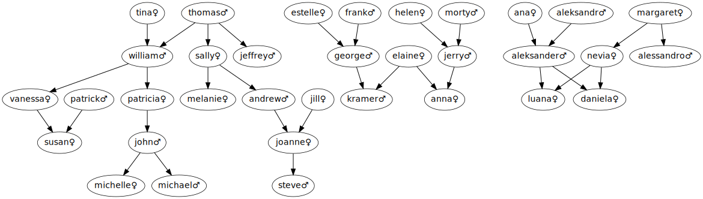

# Prolog

## Install

```bash
brew install swi-prolog
```

Prolog available on:

```txt
https://swish.swi-prolog.org/ 
https://930.ablak.arnes.si/
```

Run prolog via cli:

```bash
$ swipl # zaženi prolog
?- [<ime datoteke>]. # npr. [uvod2].
true.
```

[dodatne vaje](https://codeq.si/?s=login)

### Družinske relacije

V tem sklopu bomo definirali `predikate` za nekaj družinskih relacij, kot so »sestra«, »teta« in »prednik«. Za preizkušanje rešitev bomo uporabljali družinsko drevo (pravzaprav gozd), ki ga najdete na učilnici.



Družinske relacije v prologu opišemo s predikati `parent/2`, `male/1` in `female/1`. Zapis `parent/2` pomeni, da gre za predikat z imenom `parent` z dvema argumentoma. Primer:

```prolog
parent(tina, william).
parent(thomas, william).
parent(thomas, sally).
…
female(tina).
female(sally).
female(vanessa).
…
male(william).
male(thomas).
male(jeffrey).
…
```

Dejstvo `parent(tina, william)` pomeni, da je tina starš od williama. Imena pišemo z **malimi črkami**, ker bi jih prolog sicer obravnaval kot spremenljivke.

Datoteko `famrel.pl` v prolog naložimo z ukazom

```prolog
?- ['famrel.pl']
```

Nato lahko pišemo različne poizvedbe, npr.:

```prolog
?- parent(thomas, sally).
true.
?- parent(thomas, X).
X = william ;
X = sally .
```